

  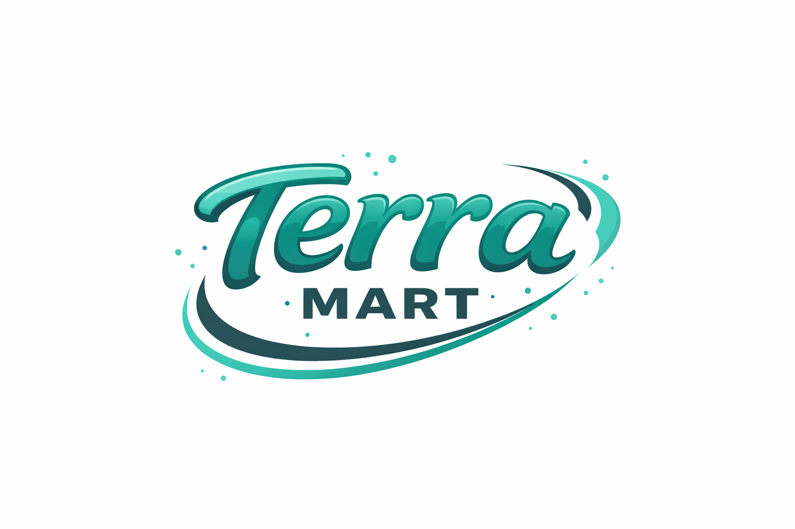

<h1 align="center"> Terra Mart: Sales Analysis </h1>

##  Project Overview
**Terra Mart** is multi-national grocery retailer, operating in the USA, Mexico, and Canada. They have a complex ecosystem of five distinct store formats—ranging from Deluxe Supermarkets to Small Grocery outlets. They want to knows the performance analysis across markets, and customers loyalty behaviors, and want to expands their market. 

The key insights and recommendations focus on the following areas:
* Revenue & Seasonality
* Product Performance
* Market Share
* Customer Segmentation

##  Insights
<h3>Revenue Trends & Regional Seasonality</h3>
<h4>Revenue Trends</h4> 

  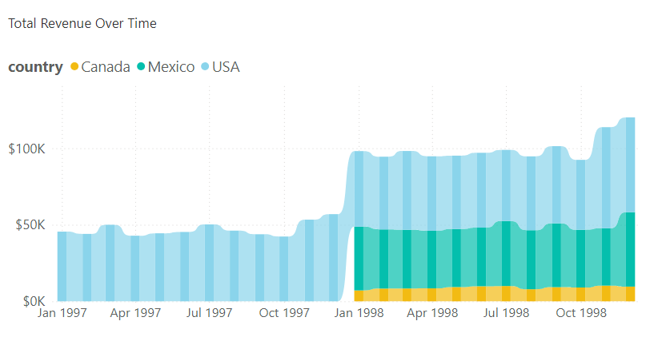

While total revenue appears to double in 1998, this is due to the inclusion of new data streams from Mexico and Canada.
After accounting for this expansion, the underlying organic <b>revenue trend remains remarkably steady</b> with minimal volatility.

<h4>Market Seasonality</h4> 
<table style="width: 100%;">
  <tr>
    <td style="width: 33%; border: none;">
      
    </td>
    <td style="width: 33%; border: none;">
      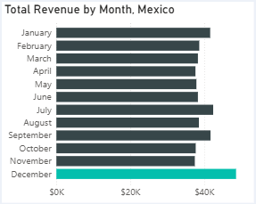
    </td>
    <td style="width: 33%; border: none;">
      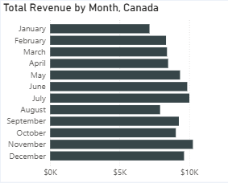
    </td>
  </tr>
</table>

Overall sales shows a clear Year-End peak in USA and Mexico, with performance increasing during November and December. This suggests high sensitivity to the Q4 holiday shopping season.

It is recommended to increase inventory and staffing during November and December to capture the proven seasonal surge.

 
<h3>Product Performance Insights</h3>
<table style="width: 100%;">
  <tr>
    <td style="width: 50%; border: none;">
      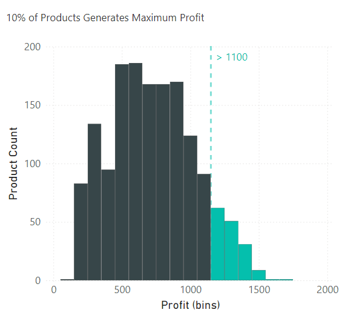
    </td>
    <td style="width: 50%; border: none;">
      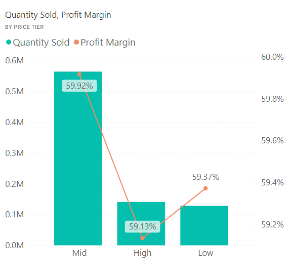
    </td>
  </tr>
</table>

<li><b>Profit Concentration: </b>A small segment of the inventory <b>(10% of products)</b> acts as the primary engine for profitability, contributing to <b>20% of total profit</b>. 
These high-performing items are concentrated within the High-Price and Mid-Price tiers.</li>
<li><b>Volume Leader: </b>Sales quantity for mid-price products is more than double the combined volume of the high and low-price tiers, indicating strong market fit and consumer demand in this segment.</li>
<li><b>Healthy Margin Range: </b>The product catalog maintains a strong profitability profile, with individual product margins ranging from a minimum of 49.02% to a high of 70.69%.</li>
<li><b>Underperforming SKU Identification: </b>We identified "Low-Performing" products as those with profit margins below 55% and low sales velocity. These items are candidates for decommissioning (removal) to optimize inventory costs and shelf space.</li>
 
<h3>Customer Segmentation and Demographics Analysis</h3>
<h4>Membership Tiers & Spending Behavior</h4>
<table style="width: 100%;">
  <tr>
    <td style="width: 50%; border: none;">
      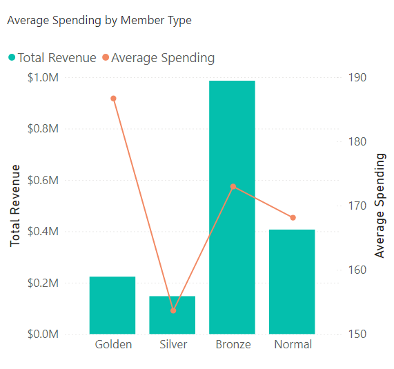
    </td>
    <td style="width: 50%; border: none;">
      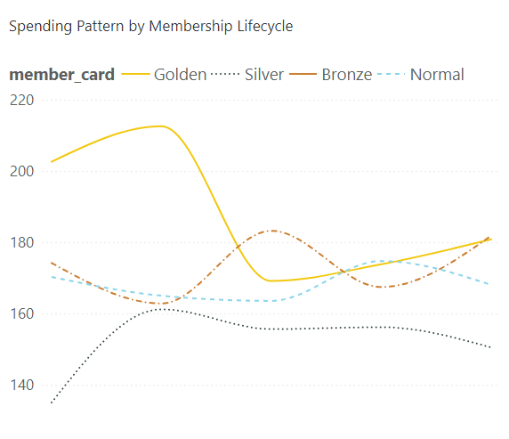
    </td>
  </tr>
</table>

<li><b>Revenue Drivers: </b>Bronze members are the primary revenue engine for the company, contributing more than double the total revenue of the next largest group (Normal members).</li>
<li><b>High-Value Segments: </b>While Bronze members lead in volume, Gold members represent the highest average spend per transaction.</li>
<li><b>Retention & Lifecycle Trends: </b>Gold Segment exhibits a significant "honeymoon period" in year one before spending patterns normalize to match other tiers. Bronze & Normal Segments show high stability and resilience, with average spending consistently fluctuating within a tight range of 160 to 180. Silver Segment consistently underperforms relative to other tiers, representing the lowest average spend across the membership lifecycle.</li>

<h4>Demographics & Socioeconomics</h4>
<table style="width: 100%;">
  <tr>
    <td style="width: 50%; border: none;">
      
    </td>
    <td style="width: 50%; border: none;">
      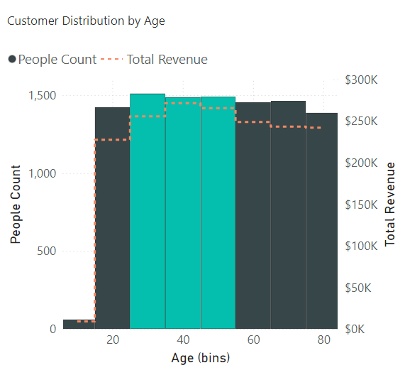
    </td>
  </tr>
</table>

<li><b>Household Influence: </b>A strong positive correlation exists between the number of children in a household and average spending, suggesting that larger families are a key target demographic for bulk grocery purchases.</li>
<li><b>Age Distribution: </b>Engagement is consistent across all age groups (20–80). However, the 30–50 age bracket serves as the core "Power User" group, generating slightly higher total revenue than other demographics. </li>
<li><b>Income Distribution: </b>The customer base is predominantly Low-Income, representing 54% of the total population.</li>
<li><b>Geographic Concentration: </b>The market remains highly centralized, with 72% of the customer base residing in the USA.</li>
 

<h2>Actionable Recommendation</h2>  
Based on the data analysis, the following strategic actions are recommended to optimize revenue and operational efficiency:

<h3>Inventory & SKU Optimization</h3>

<li><b>Capitalize on the "Profit Powerhouses": </b> Since 10% of products generate 20% of total profit, the company should ensure 100% "in-stock" availability for these high-tier items to avoid lost revenue.</li>
<li><b>Streamline Underperformers: </b>Review products with a profit margin below 55% and low sales volume. These items should be considered for decommissioning to free up shelf space and reduce inventory holding costs.</li>

<h3>Targeted Marketing & Loyalty Programs</h3>

<li><b>Parent-Centric Campaigns: </b>Given the strong positive correlation between the number of children and average spending, marketing campaigns should focus on "family-sized" promotions and bulk-buy discounts.</li>
<li><b>Member Lifecycle Management: </b>Offer "Retention Rewards" to Gold Members after their first year to prevent the observed spending drop-off.</li>
<li><b>Low-Income Value Positioning: </b>With 54% of customers in the low-income bracket, maintaining competitive pricing on "Mid-price" essentials is critical for brand loyalty.</li>

<h3>Regional Strategy</h3>

  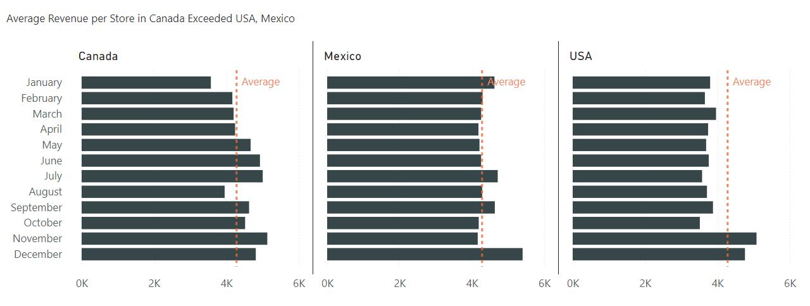

<li><b>Holiday Readiness: </b>Aggressively increase inventory and staffing in USA and Mexico during November and December to capture the proven seasonal surge.</li>
<li><b>Market Expansion: </b>Prioritize the expansion of stores in Canada, as it accounts for 17% of customer base but it serviced by only two stores. Despite the low store count, the average revenue per store in Canada exceeded both the USA and Mexico.</li>

## Methodology
1. **Data Cleaning:** Processed raw datasets using **Power Query** to handle missing values and outliers.
2. **Analysis:** Performed EDA using **DAX** measures.
3. **Visualization:** Developed an interactive **Power BI** dashboard focusing on time-series trends and store location performance.

## How to View
* **Source File:** Download the [grocery_sales_analysis.pbix](grocery_sales_analysis.pbix) in this repo to explore the DAX and data model.

#### Preview
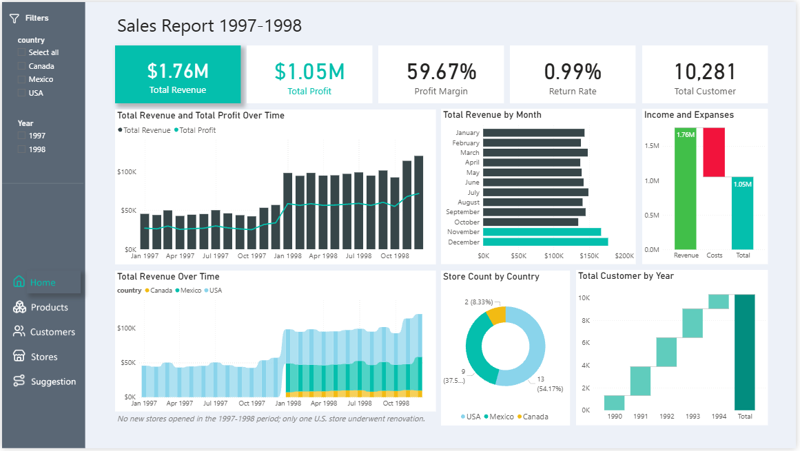
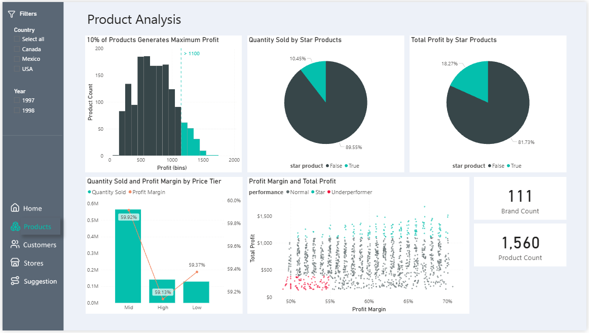
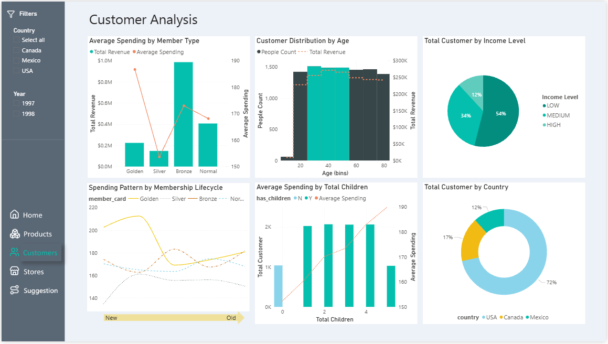
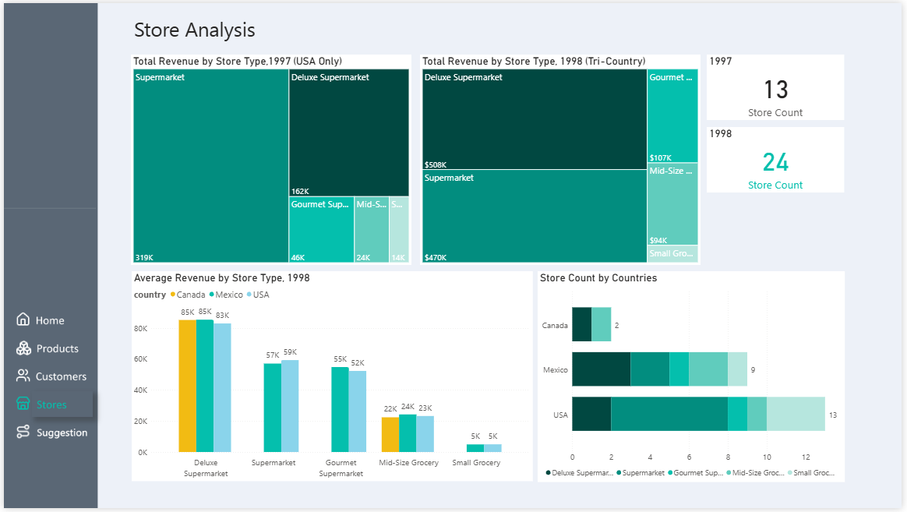
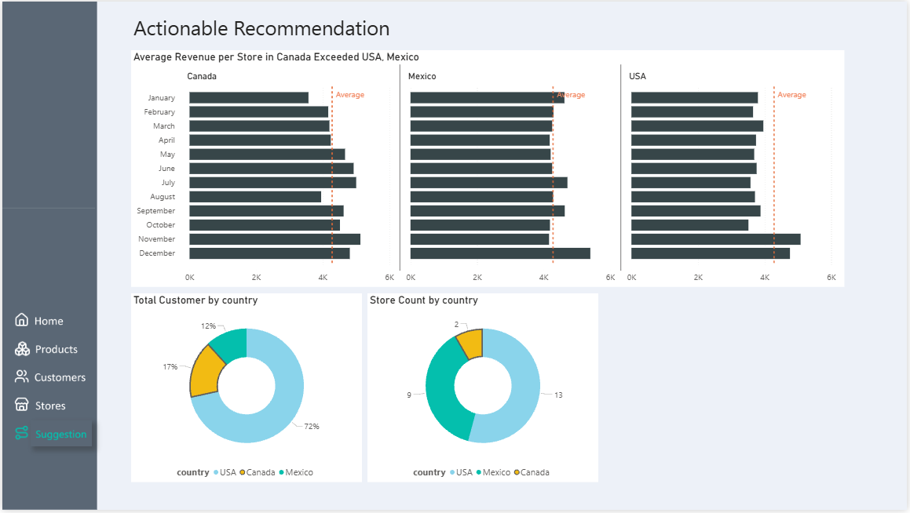
