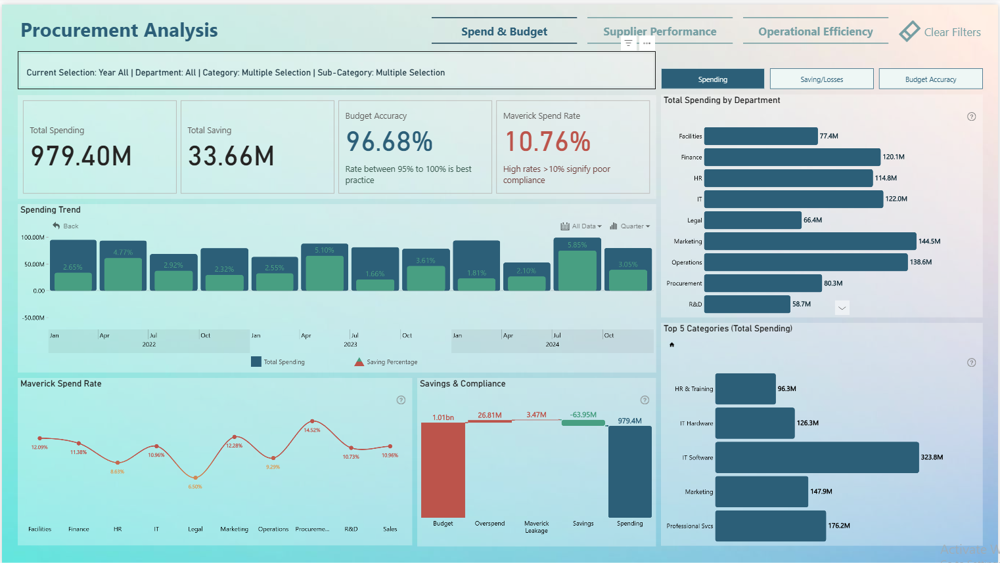

# Procurement Analysis

This strategic Procurement Dashboard transforms raw data into actionable intelligence across three core pillars. 
* Spend & Budget monitors financial velocity and variance
* Supplier Portfolio & Risk evaluates vendor stability and ESG impact
* Operational Efficiency optimizes delivery performance

## Key Performance Indicators (KPIs)
The following metrics were calculated using DAX, Power Query:

* **Spend & Budget**
    * **Total Spending**: Total spending including tax, across departments, and Item Categories
    
    * **Total Saving**: The difference between budgeted spending and actual spending.
    
    * **Budget Accuracy**: The percentage of actual spending vs budget. 
    
    * **Maverick Spend Rate**: The percentage of spending outside contracted channels.

* **Supplier Portfolio & Risk**
    * **Prefered Supplier Coverage**: The proportion of total spending allocated to suppliers classified as both Low-Risk and Strategic.
 
    * **Single Source Concentration**: Refers to the high-risk, over-reliance on a single vendor, supplier
 
    * **Weighted Average ESG Score**: Measures the sustainability and ethical impact of your supply chain by proportional spend, ensuring that your largest contracts have the most significant influence on your total ESG rating
 
    * **Weighted Supplier Risk Score**: 1–10 metric that scales each vendor's fixed risk level by their total expenditure, ensuring that high-spend partners have a proportionately larger impact on the overall portfolio’s risk profile
      
* **Operational Efficiency**
    * In Progress
      
## Tech Stack
Power BI, DAX, Data Modelling

## Dashboard Preview

